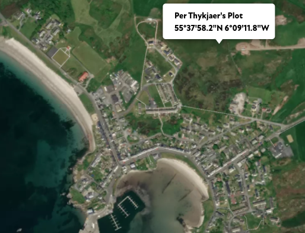

# 1st-sem-int-2022

CSS and JavaScript boilerplates and samples for the first semester internationall class 2022. 

## Flexbox - gallery exercise

### HTML

~~~~
 <section class="flexMe">

            <!-- content here -->
            

                <h1>Pizza 13) Hawaii</h1>
                
                
133,- kr.

            

            

                <h1>Pizza 14) Mascarpone</h1>
                
                
133,- kr.

            

            

                <h1>Pizza 15) Papparazzi</h1>
                
                
133,- kr.

            

            

                <h1>Pizza 16) Gorgonzola</h1>
                
                
133,- kr.

            

        </section>

~~~~

### CSS

~~~~
.flexMe {
    display: flex;
    flex-wrap: wrap;
}
~~~~

